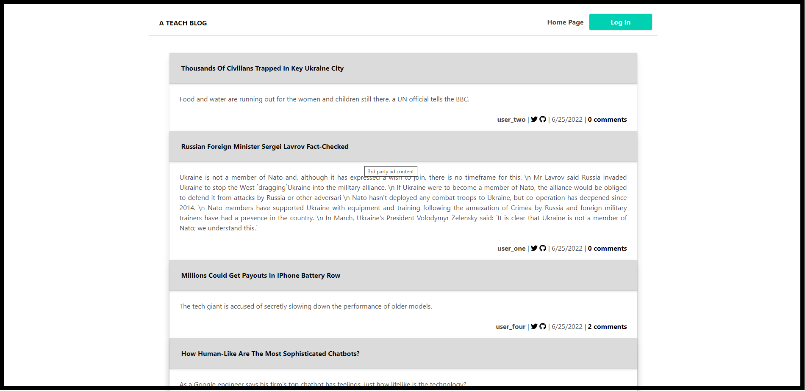
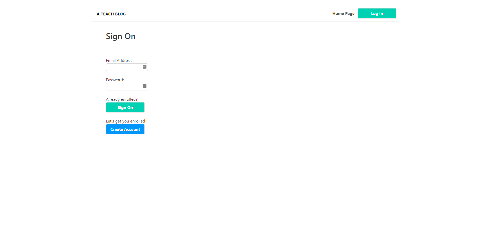
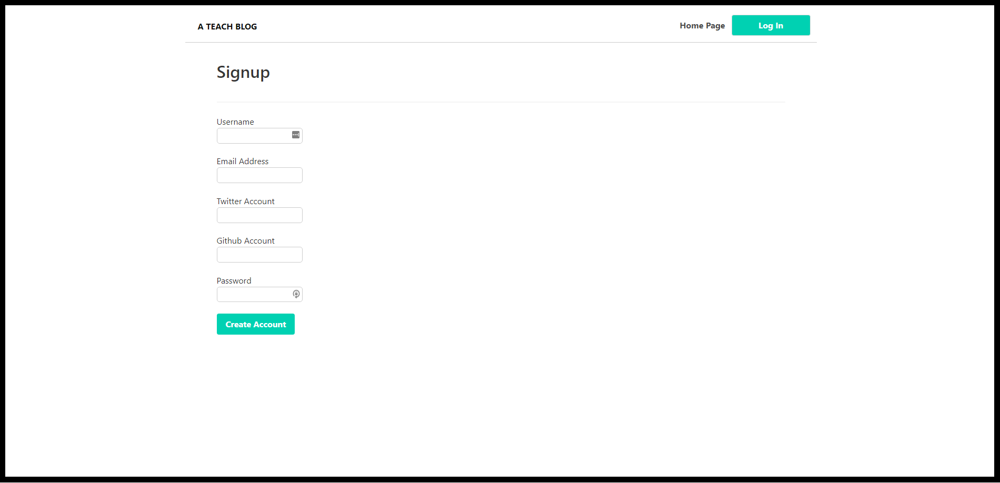
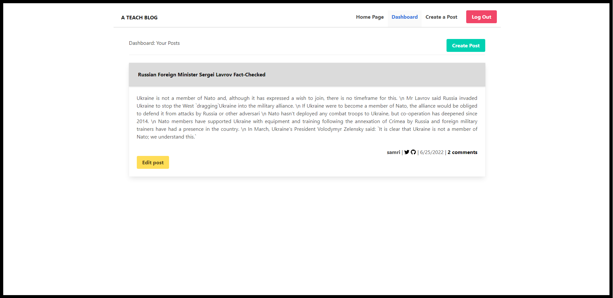
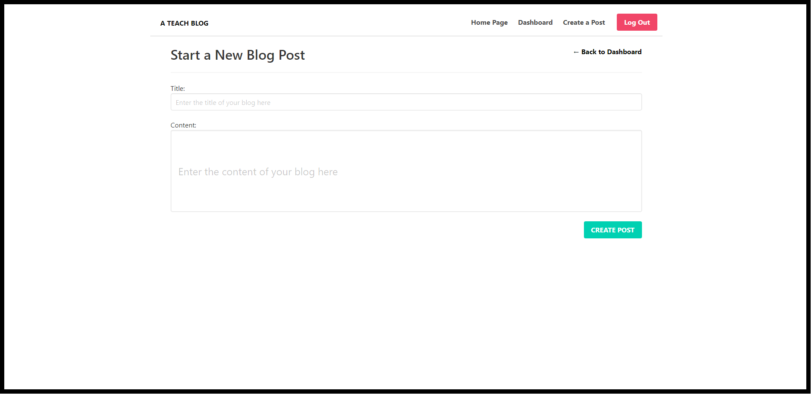
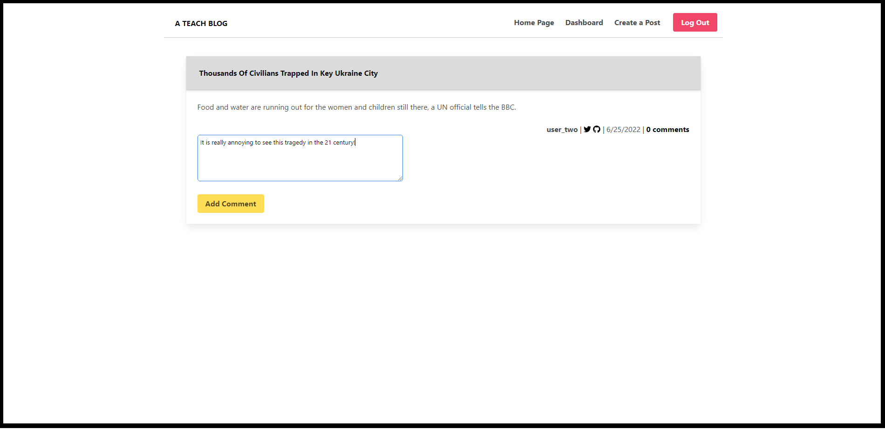

# Model View Controller Ttech Blog🔥

## Table of Content

- [Description](#description)
- [Website Preview](#website-preview)
- [Installation and Deployment](#installation-and-deployment)
- [Features](#features)
- [Sections](#sections)
- [Tools Used](#tools-used)
- [Contributing](#contributing)
- [License](#license)
- [Questions](#questions)

## Description

This is a full stack web application that uses the Model-View-Controller (MVC) paradigm to create  
a blog-style website where users can create an account, edit their information, make posts, edit posts,  
and comment on other user's posts. Users can view posts and visit links as a visitor, create their own  
account, and as an authenticated user they can add their own posts and comment on other posts as well.  
They can edit titles and content or delete their own posts as well.

## Website Preview

### Home Page

### Log In Page

### Create A New Account Page

### Dashboard

### Add Post

### Add Comment

## Installation and Deployment

# 📦

## Installation

In order to use this application, simply git clone the repo to your local so that you have the  
Node project there on your local machine. Use npm install to install the npm package dependencies  
listed in your package.json.

To use the app locally, using the command line, you should run node server.js to start the application,  
and then open https://localhost:3001/ in any web browser to launch the app.

- The app is also live at the following link:
- [live on Heroku](https://aqueous-meadow-86713.herokuapp.com/)

- You can clone the most recent version of repo into your machine
- [Github](https://github.com/ghashe/model-view-controller-tech-blog)

## Features

# 📋

⚡️ Accesible  
⚡️ Dynamic  
⚡️ responsive
⚡️ Efficient  
⚡️ Easy to read  
⚡️ Easy to modify

## Sections

# 📚

    ✔️ Home Page
    ✔️ Dashboard Page
    ✔️ Login Page
    ✔️ Signup Page
    ✔️ Footer

## Tools Used

# 🛠️

    ✔️ HTM
    ✔️ CSS
    ✔️ JavaScript ES6
    ✔️ Node.js
    ✔️ Express.js
    ✔️ dotenv (To prevent the posting of sensitive data on GitHub)
    ✔️ MySQL
    ✔️ Sequelize (npm package for integrating MySQL and Node.js)
    ✔️ bcrypt (npm package for password hashing)
    ✔️ handlebars (For html and javascript integration on the front-end)
    ✔️ Heroku (hosting platform)
    ✔️ JawsDB (a Heroku add-on for hosting the MySQL database)

## Contributing

# 💡

It would be great if you could contribute in any way

- 👯 Git clone the repo to your local machine
- 🔨🔨🔨 Develop your code
- 🔃 Create a new pull request.

## License

    MIT license has been applied to this project

## Questions

If you have any questions, feel free to contact me via the following contact information:

- Emain: emandaabyou@gmail.com
- GitHub account: [ghashe](https://github.com/ghashe)
- Linkedin: https://www.linkedin.com/in/abyou-geletu-5ba16622b

---

_This README has been generated by ❤ [Professional-README-generator](https://github.com/ghashe/professional-README-generator) © 2022_

---
